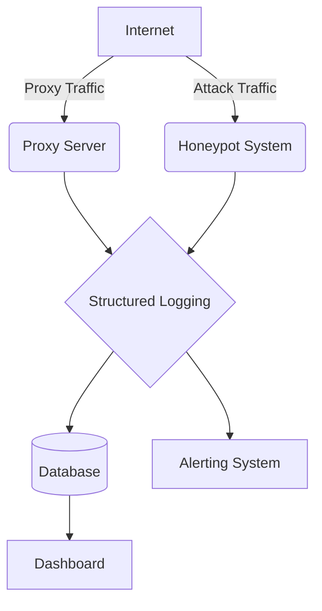

<p align="center">
  <h1 align="center">🛡️ ShadowGate</h1>
  <p align="center"><strong>Private Proxy Server & Honeypot Toolkit</strong></p>
  <p align="center">
    <a href="#features">Features</a> •
    <a href="#quick-start">Quick Start</a> •
    <a href="#configuration">Configuration</a> •
    <a href="#deployment">Deployment</a> •
    <a href="#contributing">Contributing</a>
  </p>
</p>

## Overview
ShadowGate is a self-hosted cybersecurity toolkit combining a private authenticated proxy server with a multi-protocol honeypot system. Built for security researchers, SOC teams, and network administrators.

## Features
- 🔒 **Private Proxy**: Authenticated, rate-limited, IP whitelist, HTTPS tunneling, bandwidth tracking.
- 🍯 **Honeypot**: HTTP/SSH/FTP/SMTP emulation, attacker fingerprinting, GeoIP, session recording.
- 📊 **Dashboard**: Real-time event feed, charts, dark theme.
- 🚨 **Alerting**: Slack, Discord, Email webhooks.
- 🐳 **Docker Support**: Easy deployment with Docker and Docker Compose.

## Quick Start
### pip install
```bash
pip install shadowgate
shadowgate all
```

### docker-compose
```bash
docker-compose up -d
```

## Architecture


## CLI Usage
- `shadowgate proxy`: Start only the proxy server.
- `shadowgate honeypot`: Start only the honeypot system.
- `shadowgate dashboard`: Start the dashboard.
- `shadowgate all`: Start all components.

## Configuration
Configuration is managed via a YAML config file with environment variable overrides.
Example `config.yaml`:
```yaml
proxy:
  port: 8080
  auth_enabled: true
```

## Deployment
ShadowGate can be deployed via Docker, Docker Compose, or on bare metal environments.

## API Endpoints
- `GET /api/v1/events` - Get event feed
- `GET /api/v1/stats` - Get dashboard statistics

## Security Considerations
**WARNING:** Only deploy ShadowGate on networks you are authorized to monitor. Ensure responsible use and comply with local laws and regulations.

## Contributing
Please see [CONTRIBUTING.md](CONTRIBUTING.md) for details on how to contribute.

## License
MIT License. See [LICENSE](LICENSE) for more information.
